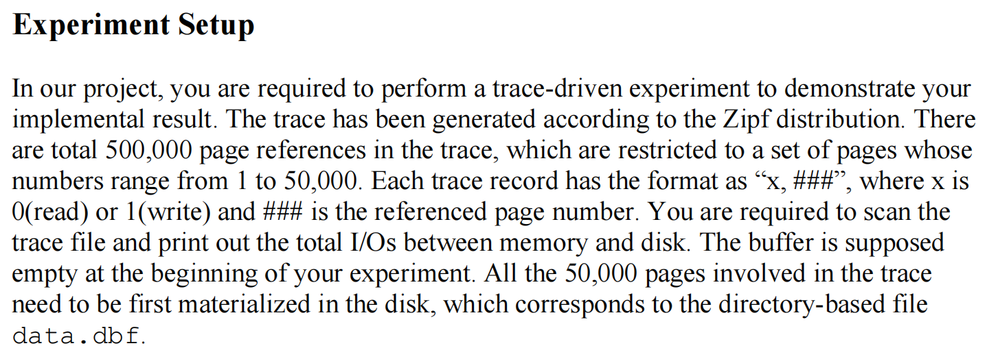
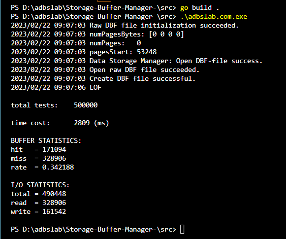

[toc]
# ADBS实验报告

> SA22011034 李昱祁

## 前言

这是本实验的 `github` 仓库，[仓库链接](https://github.com/yuqi-lee/Storage-Buffer-Manager-) 

程序运行方法：

```sh
cd src					# 进入 src/目录
go mod tidy				# 拉取所需要的 go module
go build .				# 编译
.\adbslab.com.exe 		# 执行
```

`go mod tidy`会拉取`github`上的第三方`module`，如果失败请切换网络线路或者配置国内的`GOPROXY`。如有疑问请联系我。


## 系统设计

基本按照实验文档`adbs-lab.pdf`中进行设计，分三部分进行介绍

### Experiment Setup

根据实验文档中的要求，实验开始前首先要创建`dbf`文件


因此在`main`包中引入一个新的函数`CreateAndOpenDBFFile()`，它主要做两件事：
* 在实验开始时创建`dbf`文件：构建一个空的堆文件，需要初始化其中的元数据。
  * 在文件开头用4字节记录现有page数量（实验中最多为50000个page，int32够用了）
  * 用50000Byte作为page空闲与否的标记信息。实际上50000bit就够了，这里为了操作简单浪费了一些空间
* 构建一个包含 50000 个 page（页号从0到49999）的堆文件。

这样就完成了跑实验trace前的准备工作

### Data Storage Manager

`Data Storage Manager`基本上按照实验文档进行设计。另外增添了一个字段`PagesStart`，用于记录基页的起始字节偏移量，方便写入目录指针以及获取页指针

### Buffer Manager

`Buffer Manager`也基本上按照实验文档进行设计，另外添加了一个`Data Storage Manager`类型的成员，以控制对磁盘的I/O。这点显然是需要的，只是文档中对`Buffer Manager`的定义没有提及。

此外，为了实现置换算法，`Buffer Manager`中还维护了一个双向链表，用于记录`frame`的访问情况。本次实验实现了`LRU`和``两种置换算法，后续会对比二者的性能。


## 系统实现

本系统使用`go`语言实现，需要1.18+版本以上支持（`Buffer Manager`中实现缓存置换算法用到的双向链表使用了`go`泛型，该特性在`go`版本`1.18.0`加入）

函数接口基本上都按照文档中的定义进行实现，其中利用`go`语言的`errors`替换了部分原有的整型报错返回值，另外`ReadPage`和`WritePage`两个函数改为传指针以减少IO接口上不必要的拷贝操作，类似具体细节下文不再赘述，本部分只专注于核心函数的实现逻辑讲解。

### Experiment Setup

该部分全部封装在`main`包的`ExSetUp()`函数。该函数代码如下：

```go
func ExSetUp() error {
	// Create raw DBF file
	err := bufferManager.Ds.InitFile(DBFFilePath)
	if err != nil {
		log.Printf("Raw DBF file initialization failed: " + err.Error())
	} else {
		log.Printf("Raw DBF file initialization succeeded.")
	}

	// Open raw DBF file
	err = bufferManager.Ds.OpenFile(DBFFilePath)
	if err != nil {
		log.Printf("Open raw DBF file failed: " + err.Error())
	} else {
		log.Printf("Open raw DBF file succeeded.")
	}

	for i := 0; i < 50000; i++ {
		newpage, err := bufferManager.FixNewPage()
		if err != nil {
			log.Printf("Create DBF file failed: Fix new page failed with i = %v.", i)
			return err
		}
		bufferManager.UnfixPage(newpage.Page_id)
	}

	log.Printf("Create DBF file successful.")
	return nil
}
```

可以看到，`ExSetUp()`首先调用的是`bufferManager.Ds.InitFile(DBFFilePath)`，该函数会创建`data.dbf`文件，并从文件开头开始，向其中先写入4字节的数字0，表明此时已使用的`page`数量为0；之后，又连续写入50000个0，用于表示这些页目前全都是空闲状态。至此`data.dbf`创建完毕

下面调用的是`bufferManager.Ds.OpenFile(DBFFilePath)`，该函数建立`Data Storage Manager`中的数据库文件描述符与`data.dbf`之间的联系，比较简单。

之后就是使用`FixNewPage()`构建一个50000个page（页号从0到49999）的堆文件，该函数的实现在`Buffer Manager`中介绍

### Data Storage Manager

该类定义如下：
```go
type DSMgr struct {
	pagesStart int32
	numPages   int32
	pages      [MaxPages]int32
	currFile   *os.File
}
```

其中
* `currFile`是指向数据库dbf文件的指针，
* `numPages` 和 `pages`分别记录当前已使用页的数量和全部页当前是否空闲的情况，也即dbf文件开头的信息。每次打开数据库时，`DSMgr`从dbf文件读取这些数据；数据库运行期间由`DSMgr`在内存中维护这些数据；关闭数据库时再将这些数据写回到dbf文件开头
* `pagesStart`是一个额外自定义的变量，用于标记第一个页，也即目录页开始的位置偏移量。单位是字节

####  SetUse

这个函数可以说是`Data Storage Manager`最重要的一个函数，它主要负责向目录式堆文件中加入一个新的已使用页。代码如下：
```go
func (dsm *DSMgr) SetUse(index, use_bit int32) error {
	if dsm.pages[index] == 0 && use_bit == 1 { //Start a new page.
		p := ((MaxPages*4-1)/FrameSize+1)*FrameSize + FrameSize*index

		_, err := dsm.DSeek(dsm.pagesStart, index*4)
		if err != nil {
			return err
		}
		_, err = dsm.currFile.Write(int32ToBytes(p)) 
		if err != nil {
			return err
		}

		var b BFrame = BFrame{}
		_, err = dsm.DSeek(dsm.pagesStart, p)
		if err != nil {
			return err
		}
		_, err = dsm.currFile.Write(b.Field[:]) 
		if err != nil {
			return err
		}
	}
	dsm.pages[index] = use_bit

	return nil
}
```

由于本次实验比较简单，因此新页的起始位置偏移可以计算出来，之后直接写入目录页的相应位置，每个偏移（也即所谓的指向数据页的指针）占用4个字节；之后模拟向新页的位置写入一整页的数据。

#### 其它函数

* `Seek()`函数直接使用`go`标准库的对应函数封装完成；
* `ReadPage()`和`WritePage()`都是直接向文件写固定大小的数据，起始位置都已经提前通过`Seek()`调好，比较简单，同时在其中可以统计实验需要测试的IO次数；
* `CloseFile()`需要将`DSMgr`中维护的元数据写回到dbf文件中
* 其它比较简单的函数不再赘述

### Buffer Manager

该类定义如下
```go
type BMgr struct {
	Ds   dsm.DSMgr
	lru  bidlist.List[int32]
	buf  [BufferSize]*dsm.BFrame
	ftop [BufferSize]int32
	ptof [BufferSize]*BCB
}
```

其中
* `buf`是`frame`池，指向缓冲区
* `ftop`用于记录现在池中`frame`对应的`page`编号，与`buf`按数组相对位置一一对应；-1表示此时该frame还没有被磁盘page填充
* `ptof`用于通过`page`编号查找对应`BCB`链的首块
* `Ds`即为`Data Storage Manager`类型的成员变量
* `lru`是一个双向链表，用于记录池中`frame`的访问信息，帮助实现置换算法

#### FixNewPage()

该函数用于向数据库中增添一个新的使用页，并且将其加入`frame`池中
* 首先通过`Data Storage Manager`找到一个空闲页面
* 之后调用`FixPage()`将该磁盘页加载到内存`buffer`中

代码此处不再展示

#### FixPage()

该函数对于给定的磁盘`page`编号，查询其是否在内存`buffer`中：
* 若在，则返回对应的`frame`编号
* 若不在，则将其数据从磁盘读出，填入内存`buffer`的空闲位置中；若内存`buffer`已经满了，则通过置换算法找到一个`frame`换出，将新`page`换入

代码如下：
```go
func (bm *BMgr) FixPage(page_id, prot int32) (int32, error) {
	var res int32
	var err error
	if page_id >= dsm.MaxPages || page_id < 0 {
		return 0, errors.New("invalid page_id.")
	}

	if prot != 0 {
		log.Println("invalid prot.")
		prot = 0
	}

	bcb := bm.ptof[Hash(page_id)]
	for bcb != nil && bcb.next != nil && bcb.page_id != page_id {
		bcb = bcb.next
	}

	if bcb != nil && bcb.page_id == page_id {
		// The page to be read and written is already in the cache.
		// The lru table cache hit should be updated.
		Hit += 1
		res = bcb.frame_id
		for n := bm.lru.FrontNode(); n != nil; n = n.Next() {
			if n.Value == bcb.frame_id {
				bm.lru.Remove(n)
				break
			}
		}
		bm.lru.PushFront(bcb.frame_id)
		bcb.count = bcb.count + 1
	} else {
		Miss += 1
		res, err = bm.NewBCB(page_id)
		if err != nil {
			return 0, errors.New("Create new BCB failed." + err.Error())
		}
		var bf *dsm.BFrame
		bf, err = bm.Ds.ReadPage(page_id)
		if err != nil {
			return 0, err
		}
		bm.buf[res] = bf
	}
	return res, err
}
```
简要解释代码
* `bcb := bm.ptof[Hash(page_id)]` 先算出该磁盘page应该落在`buffer`的哪个位置
* `for bcb != nil && bcb.next != nil && bcb.page_id != page_id {...}` 遍历对应的`BCB`链表
* `if bcb != nil && bcb.page_id == page_id` 若在`BCB`链表中找到，则说明已经在内存`buffer`，直接返回对应的`frame`编号即可；同时相当于访问了一次该页，将其按规则插入frame编号链表
  * 若没找到，则为此磁盘page创建新的`BCB`，并将其加入到内存`buffer`中。在这个过程中，可能需要通过置换算法换出某个旧page

#### NewBCB()

这个函数的主要作用是为即将新换入内存的`page`创建一块`BCB`，同时还负责触发置换逻辑`SelectVictim`，以及将新`BCB`插入`ptof`对应位置的链表上。代码如下：

```go
func (bm *BMgr) NewBCB(page_id int32) (int32, error) {
	var res int32 = -1
	var err error
	var bcb *BCB = &BCB{page_id: -1, frame_id: -1}

	if bm.lru.Size() >= int(BufferSize) {
		res, err = bm.SelectVictim()
		if err != nil {
			return -1, err
		}
		bm.RemoveLRUEle(res)
	} else { // Debug: Prepare for finding free frames below to prevent underflow!
		res = 0
	}

	// Find the free space of ftop and use it,
	// but the relationship of ‘BCB -> frame’ needs to be established later
	bcb.page_id = page_id
	suc := false
	for j := 0; j < int(BufferSize); j++ {
		i := (int32(j) + res) % BufferSize // The frame just deleted (if any) should be empty
		if bm.ftop[i] == -1 {
			bm.ftop[i] = page_id
			bcb.frame_id = i
			res = i
			suc = true
			break
		}
	}
	if suc == false {
		return -1, errors.New("lru and ftop conflict.")
	}

	// The new bcb needs to connect to the open chain of the ptof hash table
	// to find the BCB before obtaining the frame to realize the ptof.
	head := bm.ptof[Hash(bcb.page_id)]
	bcb.next = head
	bm.ptof[Hash(bcb.page_id)] = bcb
	bcb.count = bcb.count + 1

	bm.lru.PushFront(res)
	return res, nil
}
```

简要解释代码：
* 申请新BCB肯定是因为要把`page`换入到内存中，因此先判断内存`buffer`是否已经满了，若满了就通过置换算法踢出去一个
* 找到一个空闲的`frame`。如果刚刚才换出了一个`frame`，就从该`frame`编号开始找，单线程此情况下应该直接就能找到
* 使用头插法将新`BCB`插入到`ptof`维护的`BCB`链表中

#### SelectVictim()
该函数实现了`buffer`的置换算法，选择根据`lru`或者其它算法选出一个受害者`frame`，将其换出，若该`frame`被修改过则触发一次写数据库文件。结果将对应的`frame`编号返回，代码如下：

```go
func (bm *BMgr) SelectVictim() (int32, error) {
	var res int32
	var bcb *BCB = nil
	n := bm.lru.BackNode()
	if bm.lru.Size() < 1 {
		return -1, errors.New("lru cache is empty.")
	}

	for n != nil {
		bcb = bm.ptof[Hash(bm.ftop[n.Value])]
		for bcb.frame_id != n.Value && bcb.next != nil {
			bcb = bcb.next
		}
		if bcb.frame_id == n.Value && bcb.count <= 0 {
			break
		}
		n = n.Prev()
	}

	if bcb != nil && (bcb.frame_id != n.Value || bcb.count > 0) {
		return 0, errors.New("All items in the buffer are occupied and cannot be released.")
	} else {
		res = bcb.frame_id
		if bcb.dirty == 1 {
			bm.Ds.WritePage(bcb.page_id, bm.buf[res])
		}
		bm.RemoveBCB(bcb, bcb.page_id)
	}
	return res, nil
}
```

简要解释代码如下：
* 前几行是简单的变量声明以及判空
* `for n != nil {...}` 是在从后向前遍历`lru`链表。主要是考虑到多线程情况下可能此时最尾的`frame`的`bcb.count`不为`0`，因此有可能继续沿`lru`链表向前找；单线程情况下，通过`lru`链表最后一个节点的`frame`编号查找到的`BCB`应该已经符合要求，会直接跳出
* 类似地，函数尾部的`if-else`对中，单线程情况下只会进入`else`情况，判断该页是否更新了需要写回文件，并将`BCB`删除即可

#### 其它函数

* `WriteDirtys()`：在数据库进程关闭时，遍历一遍所有的`frame`，对于其中发生过更新者写回文件
* `Init()`：初始化`Buffer Manager`的相关变量：
  * `buf`是指针数组，需要给指针分配内存
  * `ftop`的空闲标志是-1（因为`page`编号从0开始），而go变量默认初始值是0，因此需要显式地把它们都置为-1
* 其余函数不再赘述


## 运行结果

**注：为了方便起见，我在测试trace最后一行多加了一个换行符，否则运行本程序跑trace会少读一行数据！**

测试环境：
* i7-11800H
* 三星980 evo
* Win11专业版
* go version 1.19.4

测试结果：


* 运行时间：$2809$ms
* Buffer命中率：$34.22\%$
* 磁盘I/O：$490448$次
  * 读磁盘：$328906$次
  * 写磁盘：$161542$次

## 总结

通过本次实验，我对本课程中所学以下几点知识有了更深的认识与理解：
* 块在文件中的组织：实现了一个目录式堆文件，并且手动维护基页的数据
* 缓冲区结构：`frame`以及`BCB`的组织方式
* 缓冲区替换策略：实现了LRU替换策略
